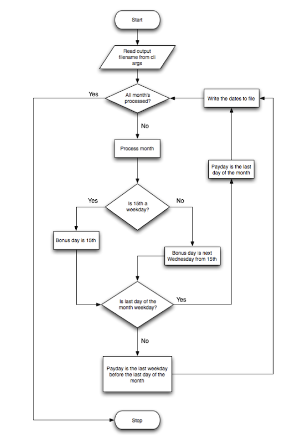

# BasWorld Pay Dates Challenge

## Intro...
This assignment was created for BasWorld. The original assignment is at the bottom of this readme.

## Decision Rationale
This application is built on a Laravel framework, the consideration was made to create this demo using the Symfony packages as to only use what is needed, packages would be symfony/console, but the choice was made for Laravel, not because the codebase is more compact or faster but for the following considerations:
- Easier to maintain and expand
- Laravel Developers are easier to find in The Netherlands
- Laravel development is generally speaking cheaper

In addition Laravel was picked with a bit of foresight as this is now just a command -> CSV Export, however I would advice against having a developer export these dates each time on request(this assumption was made because of the csv format export indicating a process that assists human input, instead of a more automation based setup with api's for connectivity between systems). 

A user interface would be preferred where payroll could log in and see/export this info themselves preventing noise for the development team (ie: can you export X, can you make an excel file, etc). For this simple setup i would suggest a Filament admin panel, or integrate this feature in an existing application if that already exists.

Should the application remain only a simple CLI interface then a more stripped down framework (or a cloud function/lamda function would be even better), should this repository be a data-hub of some sorts then a stripped down version of Laravel named Laravel Zero could be considered.


## Prerequisites
- have docker-compose installed, if you have docker desktop this is already the case.

## First install and setup
``` bash
cp .env.example .env
docker-compose up -d
docker-compose exec php composer install
```

## Run CLI Command
Running this command creates a csv file in the root of this application.
``` bash
docker-compose exec php php artisan app:generate-payroll-dates
```


---
## Original Assignment

This assignment gives us a good understanding about the thought-process and the capabilities of the developer. This doesn’t have to be a rock-solid, highly scalable super fancy production-ready application, but just something that allows us to get an idea of the developer's skills and level.

Try to keep things simple. If frameworks, libraries or databases are needed to write the application, please mention them and the arguments why they were required in the documentation for this assignment.

NOTE: This is a sample code and will only be used for evaluation purposes

Requirements:

You are required to create a small command-line utility to help a fictional company determine the dates they need to pay salaries to their sales department.

This company is handling their sales payroll in the following way:

Sales staff gets a monthly fixed base salary and a monthly bonus.
The base salaries are paid on the last day of the month unless that day is a Saturday or a Sunday (weekend).
On the 15th of every month bonuses are paid for the previous month, unless that day is a weekend. In that case, they are paid the first Wednesday after the 15th.
The output of the utility should be a CSV file, containing the payment dates for the remainder of this year. The CSV file should contain a column for the month name, a column that contains the salary payment date for that month, and a column that contains the bonus payment date For your convenience, we've added the following flow-chart to visualize the requirements
For your convenience, we've added the following flow-chart to visualize the requirements

For your convenience, we've added the following flow-chart to visualize the requirements

